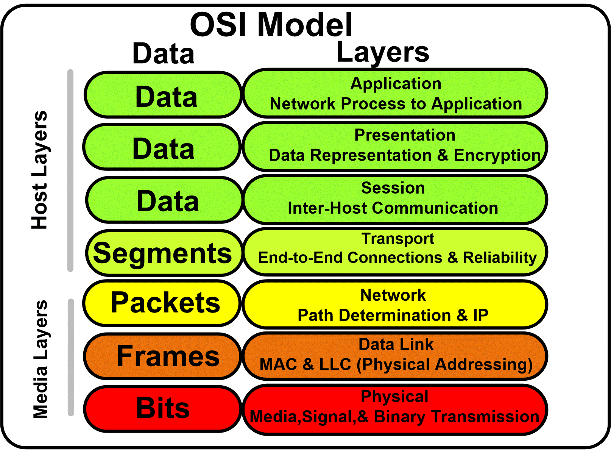
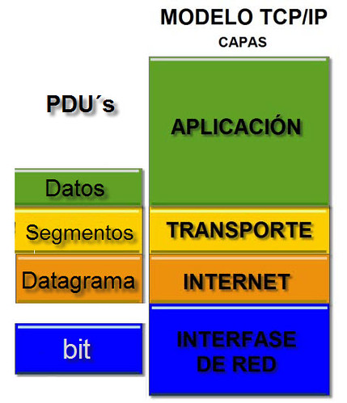
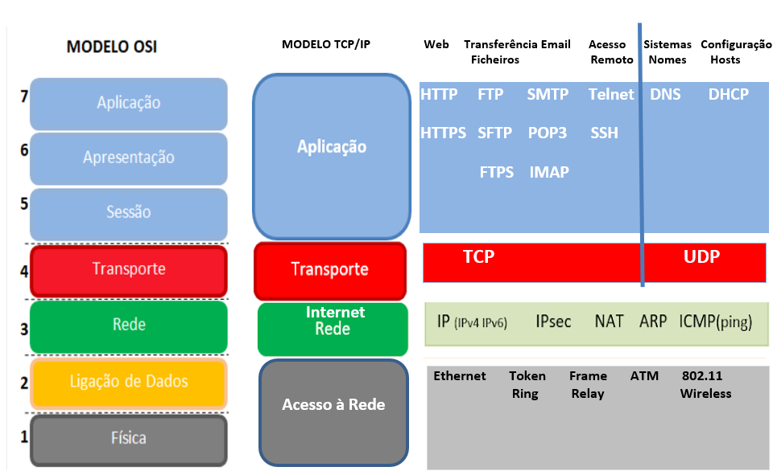

# Modelos OSI y TCP/IP

## Modelo OSI (Open Systems Interconnection)

El **Modelo OSI** es un marco teórico compuesto por siete capas, cada una de las cuales describe una etapa específica en el proceso de comunicación de datos en una red. A continuación, se detalla cada capa:

### 1. Capa Física (Physical Layer)
   - **Función:** Esta capa se encarga de la transmisión y recepción de datos en su forma más básica, como señales eléctricas, ópticas o de radio, a través de los medios físicos de comunicación (cables, fibra óptica, aire, etc.). Define las características físicas del medio de transmisión, incluyendo el tipo de cables, conectores y la disposición de los pines.
   - **Ejemplos:**
     - **Ethernet (IEEE 802.3):** Define cómo se codifican y transmiten las señales eléctricas a través de un cable de cobre.
     - **Wi-Fi (IEEE 802.11):** Define cómo se transmiten las señales de radio en una red inalámbrica.
     - **Cables:** UTP (Unshielded Twisted Pair), STP (Shielded Twisted Pair), fibra óptica.
     - **Dispositivos:** Hubs, repetidores.
   - **Conceptos Clave:**
     - **Voltaje y Señalización:** Define cómo se representan los bits (0s y 1s) en señales eléctricas.
     - **Frecuencia:** En redes inalámbricas, define las frecuencias utilizadas para la transmisión de datos.

### 2. Capa de Enlace de Datos (Data Link Layer)
   - **Función:** Proporciona un enlace fiable de datos entre dos dispositivos conectados directamente en una red. Se encarga de la detección y corrección de errores, el control de acceso al medio (para evitar colisiones) y el direccionamiento físico a través de direcciones MAC (Media Access Control). Se divide en dos subcapas: LLC (Logical Link Control) y MAC (Media Access Control).
   - **Ejemplos:**
     - **Ethernet:** Define los protocolos y estándares para la comunicación en redes LAN.
     - **Wi-Fi:** Define los estándares para la comunicación inalámbrica.
     - **Switches:** Utilizan direcciones MAC para enviar datos al dispositivo correcto en una red local.
   - **Conceptos Clave:**
     - **Dirección MAC:** Identificador único asignado a cada interfaz de red para el control de acceso al medio.
     - **Tramas (Frames):** Unidad de datos en esta capa, que incluye encabezado y datos de control de errores.

### 3. Capa de Red (Network Layer)
   - **Función:** Gestiona el direccionamiento lógico y el enrutamiento de los datos entre dispositivos en diferentes redes. Utiliza direcciones IP (Internet Protocol) para determinar la mejor ruta para los datos. También se encarga de la fragmentación y reensamblado de paquetes.
   - **Ejemplos:**
     - **IP (Internet Protocol):** Define el esquema de direccionamiento y el enrutamiento de paquetes.
     - **Routers:** Dispositivos que encaminan paquetes entre diferentes redes.
     - **Protocolos:** ICMP (Internet Control Message Protocol), ARP (Address Resolution Protocol).
   - **Conceptos Clave:**
     - **Dirección IP:** Dirección lógica asignada a cada dispositivo en una red.
     - **Paquetes (Packets):** Unidad de datos en esta capa, que incluye el encabezado IP con la dirección de origen y destino.

### 4. Capa de Transporte (Transport Layer)
   - **Función:** Proporciona transferencia de datos fiable (o no fiable) entre aplicaciones a través de la red. Gestiona el control de flujo, el control de errores y la segmentación de datos. Los protocolos más comunes en esta capa son TCP (Transmission Control Protocol) y UDP (User Datagram Protocol).
   - **Ejemplos:**
     - **TCP:** Protocolo orientado a la conexión que garantiza la entrega de datos en el orden correcto y sin errores.
     - **UDP:** Protocolo sin conexión que no garantiza la entrega de datos, pero es más rápido y eficiente para ciertos tipos de tráfico.
   - **Conceptos Clave:**
     - **Segmentos:** Unidad de datos en TCP.
     - **Datagramas:** Unidad de datos en UDP.
     - **Números de Secuencia y Acknowledgments:** Utilizados por TCP para asegurar la entrega correcta de los datos.

### 5. Capa de Sesión (Session Layer)
   - **Función:** Gestiona las sesiones de comunicación entre aplicaciones. Permite establecer, mantener y terminar conexiones (sesiones) entre aplicaciones. También se encarga de la sincronización de diálogos y la recuperación de sesiones.
   - **Ejemplos:**
     - **RPC (Remote Procedure Call):** Protocolo que permite que un programa solicite un servicio a un programa ubicado en otro ordenador en una red.
     - **NetBIOS:** Protocolo utilizado en redes Windows para permitir la comunicación entre aplicaciones.
   - **Conceptos Clave:**
     - **Establecimiento y Terminación de Sesiones:** Proceso de iniciar y finalizar una comunicación.
     - **Control de Diálogo:** Gestión del intercambio de datos entre aplicaciones.

### 6. Capa de Presentación (Presentation Layer)
   - **Función:** Traduce los datos entre el formato utilizado por la red y el formato utilizado por la aplicación. Se encarga de la encriptación, compresión y conversión de datos.
   - **Ejemplos:**
     - **SSL/TLS:** Protocolos utilizados para encriptar datos transmitidos a través de la red.
     - **Formato de Datos:** Conversión entre diferentes formatos de datos como ASCII a EBCDIC, o compresión de datos.
   - **Conceptos Clave:**
     - **Encriptación:** Proceso de convertir datos en un formato seguro que solo puede ser leído por destinatarios autorizados.
     - **Compresión:** Reducción del tamaño de los datos para mejorar la velocidad de transmisión.

### 7. Capa de Aplicación (Application Layer)
   - **Función:** Proporciona servicios de red directamente a las aplicaciones del usuario. Es la capa más cercana al usuario final y gestiona las interfaces y protocolos que permiten la interacción con la red.
   - **Ejemplos:**
     - **HTTP:** Protocolo utilizado para la transferencia de páginas web.
     - **FTP:** Protocolo utilizado para la transferencia de archivos.
     - **SMTP:** Protocolo utilizado para el envío de correos electrónicos.
   - **Conceptos Clave:**
     - **Servicios de Aplicación:** Funciones y servicios proporcionados por la red que son utilizados directamente por las aplicaciones del usuario.
     - **Protocolo de Comunicación:** Conjunto de reglas que define cómo se comunican las aplicaciones en la red.

## Modelo TCP/IP (Transmission Control Protocol/Internet Protocol)

El modelo TCP/IP es un marco práctico que describe cómo se comunican los datos en Internet. A diferencia del modelo OSI, el modelo TCP/IP tiene cuatro capas principales:

### 1. Capa de Acceso a la Red (Network Access Layer)
   - **Función:** Combina las funciones de las capas *Física* y de *Enlace de Datos* del modelo OSI. Gestiona el acceso al medio físico y la transferencia de datos entre dispositivos conectados directamente.
   - **Ejemplos:**
     - **Ethernet:** Define cómo se codifican y transmiten las señales eléctricas a través de un cable de cobre.
     - **Wi-Fi:** Define cómo se transmiten las señales de radio en una red inalámbrica.
   - **Conceptos Clave:**
     - **Tramas:** Unidad de datos en esta capa, que incluye encabezado y datos de control de errores.
     - **MAC (Media Access Control):** Dirección física utilizada para el control de acceso al medio.

### 2. Capa de Internet (Internet Layer)
   - **Función:** Equivale a la capa de Red del modelo OSI. Gestiona el direccionamiento lógico y el enrutamiento de los paquetes de datos entre dispositivos en diferentes redes.
   - **Ejemplos:**
     - **IP (Internet Protocol):** Define el esquema de direccionamiento y el enrutamiento de paquetes.
   - **Conceptos Clave:**
     - **Paquetes (Packets):** Unidad de datos en esta capa, que incluye el encabezado IP con la dirección de origen y destino.
     - **Dirección IP:** Dirección lógica asignada a cada dispositivo en una red.

### 3. Capa de Transporte (Transport Layer)
   - **Función:** Proporciona transferencia de datos fiable o no fiable entre aplicaciones a través de la red. Gestiona el control de flujo, el control de errores y la segmentación de datos.
   - **Ejemplos:**
     - **TCP (Transmission Control Protocol):** Protocolo orientado a la conexión que garantiza la entrega de datos en el orden correcto y sin errores.
     - **UDP (User Datagram Protocol):** Protocolo sin conexión que no garantiza la entrega de datos, pero es más rápido y eficiente para ciertos tipos de tráfico.
   - **Conceptos Clave:**
     - **Segmentos:** Unidad de datos en TCP.
     - **Datagramas:** Unidad de datos en UDP.
     - **Números de Secuencia y Acknowledgments:** Utilizados por TCP para asegurar la entrega correcta de los datos.

### 4. Capa de Aplicación (Application Layer)
   - **Función:** Combina las capas de *Sesión, Presentación y Aplicación* del modelo OSI. Proporciona servicios de red a las aplicaciones del usuario.
   - **Ejemplos:**
     - **HTTP:** Protocolo utilizado para la transferencia de páginas web.
     - **FTP:** Protocolo utilizado para la transferencia de archivos.
     - **SMTP:** Protocolo utilizado para el envío de correos electrónicos.
   - **Conceptos Clave:**
     - **Servicios de Aplicación:** Funciones y servicios proporcionados por la red que son utilizados directamente por las aplicaciones del usuario.
     - **Protocolo de Comunicación:** Conjunto de reglas que define cómo se comunican las aplicaciones en la red.

## Ejemplo de Comunicación: Desde el Modelo OSI hasta TCP/IP

Supongamos que un usuario quiere acceder a una página web utilizando su navegador. El proceso de comunicación se puede desglosar de la siguiente manera, siguiendo las capas de los modelos OSI y TCP/IP:

1. **Aplicación (Capa de Aplicación en OSI y TCP/IP):**
   - El navegador web genera una solicitud HTTP para obtener una página web de un servidor.
   - La solicitud HTTP se prepara y se pasa a la capa de Transporte.

2. **Transporte (Capa de Transporte en OSI y TCP/IP):**
   - La solicitud HTTP se encapsula en un segmento TCP, que incluye el puerto de destino (por ejemplo, el puerto 80 para HTTP) y el número de secuencia para garantizar la entrega correcta.
   - El segmento TCP se pasa a la capa de Internet.

3. **Red (Capa de Red en OSI y Capa de Internet en TCP/IP):**
   - El segmento TCP se encapsula en un paquete IP, que incluye las direcciones IP de origen y destino.
   - El paquete IP se pasa a la capa de Enlace de Datos.

4. **Enlace de Datos (Capa de Enlace de Datos en OSI y Capa de Acceso a la Red en TCP/IP):**
   - El paquete IP se encapsula en una trama Ethernet, que incluye las direcciones MAC de origen y destino.
   - La trama Ethernet se pasa a la capa Física.

5. **Física (Capa Física en OSI y Capa de Acceso a la Red en TCP/IP):**
   - La trama Ethernet se convierte en señales eléctricas o de radio y se envía a través del cable Ethernet o la conexión Wi-Fi hacia el router.
   - El router recibe las señales, decodifica la trama Ethernet y utiliza la dirección IP para enrutar el paquete hacia su destino.

### En el servidor de destino, el proceso se invierte:

1. **Física:** El servidor recibe las señales y las convierte en una trama Ethernet.
2. **Enlace de Datos:** La trama Ethernet se descompone para extraer el paquete IP.
3. **Red:** El paquete IP se descompone para extraer el segmento TCP.
4. **Transporte:** El segmento TCP se descompone para extraer la solicitud HTTP.
5. **Aplicación:** El servidor procesa la solicitud HTTP y responde con la página web solicitada, siguiendo el mismo proceso de encapsulación y transmisión en las capas correspondientes.

## Comparación entre OSI y TCP/IP

### Capas:
- OSI tiene siete capas; TCP/IP tiene cuatro capas.

### Uso:
- El modelo OSI es más teórico y se utiliza principalmente para la enseñanza y conceptualización.
- El modelo TCP/IP es más práctico y se utiliza para describir la arquitectura de Internet.

## En resumen

El modelo OSI y el modelo TCP/IP son fundamentales para entender cómo funcionan las redes de comunicación. El modelo OSI proporciona una estructura teórica detallada con siete capas, mientras que el modelo TCP/IP, más práctico y utilizado en la implementación real, tiene cuatro capas. Ambos modelos ayudan a comprender y diseñar sistemas de comunicación efectivos y eficientes.